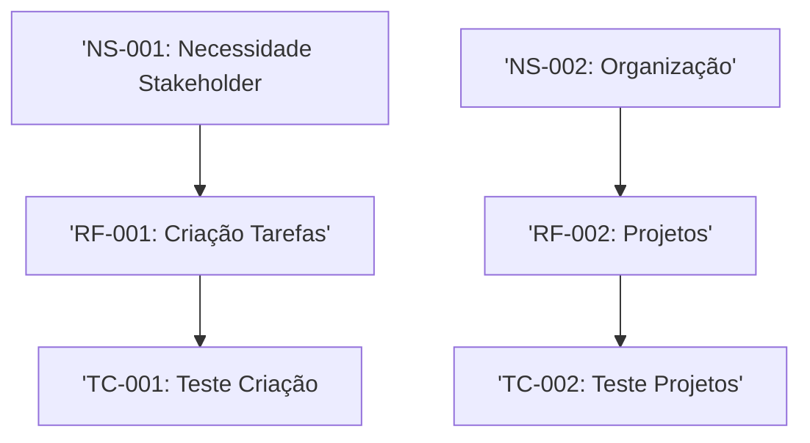

# Sistema de Gestão de Tarefas - Especificação de Requisitos

## 1. Introdução

### 1.1 Propósito

Este documento especifica os requisitos funcionais e não-funcionais para o Sistema de Gestão de Tarefas (SGT). Seguindo o padrão IEEE 29148.

### 1.2 Escopo

O SGT permitirá que usuários criem, organizem e acompanhem tarefas pessoais e profissionais com sistema de prioridades e prazos.

### 1.3 Definição e Acrônimos

- **SGT**: Sistema de gestão de tarefas;
- **RF**: Requisitos funcionais;
- **RNF**: Requisitos não-funcionais;
- **Sprint**: Período de 2 semanas de desenvolvimento.

## 2. Descrição Geral

### 2.1 Perspectiva do produto

O SGT será uma aplicação web responsável com sincronização em nuvem.

### 2.2 Funções Principais

- Criação e edição de tarefas;
- Organização por projetos e tags;
- Sistema de notificação;
- Relatório de produtividade.

## 3. Requisitos Específicos

### 3.1 Requisitos Funcionais

#### RF-0001: Criação de Tarefas

**Descrição**: O sistema deve permitir  que o usuário crie tarefas com título, descrição, data de vencimento e prioridade.
**Prioridade**: Alta.
**Versão**: 1.0
**Data**: 2026-03-25
**RAstreabilidade**: Derivado de Necessidades do StakeHolder (NS-001).
**Critérios de Aceitação**:

- [ ] Usuário pode criar, renomear e excluir tarefas.
- [ ] Formulário com campos obrigatórios (título) e opcionais.
- [ ] Níveis de prioridade: Baixa, média, alta e urgente.
- [ ] Confirmação visual após criação.
- [ ] Validação de dados das tarefas (não permitir datas vazias).

---

#### RF-002: Organização por Projetos

**Descrição**: O sistema deve permitir agrupar tarefas em projetos personalizados.
**Prioridade**: Média.
**Versão**: 1.0
**Data** 2026-03-25
**Rastreabilidade**: Derivado de NS-002.
**Critérios de Aceitação**:

- [ ] Usuário pode criar, renomear e excluir projetos.
- [ ] Tarefas podem ser atribuidas a um ou mais projetos.
- [ ] Visualização filtrada por projetos.

---

### 3.2 Requisitos Não-Funcionais

#### RNF-001: Desempenho

**Descrição**: O sistema deve carregar a lista de tarefas em menos de 1 segundo para até 100 tarefas.
**Categoria**: Desempenho.
**Prioridade**: Alta.
**Versão**: 1.0
**Métrica**: Tempo de resposta < 1s para 95% das requisições.

--- 

#### RNF-001: Segurança

**Descrição**: O sistema deve implementar autenticação Oauth 2.0 e criptografia TLS 1.3.
**Categoria**: Segurança.
**Prioridade**: Crítica.
**Versão**: 1.0
**Métrica**: Conformidade LGPD, GDPR.

---

## 4. Controle de Versões

### Histórico de Alterações

|Versão|Data|Autor|Modificação|
|------|----|-----|-----------|
|1.0|2026-03-25|Luna|Versão Inicial|

### Rastreabilidade

Gráfico de Rastreabilidade

