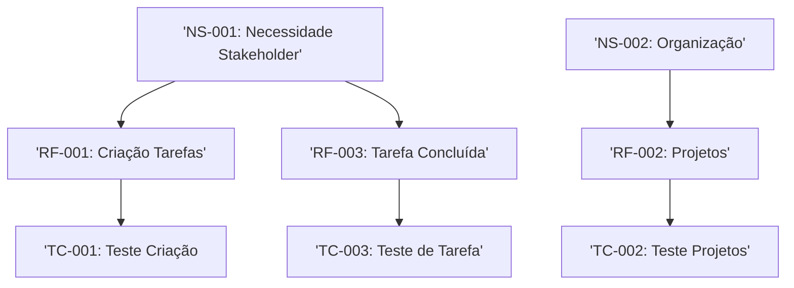

<<<<<<< HEAD
# Curso de Levantamento de Requisitos - 60h (80 aulas)

## Módulo 1 - Introdução a Levantamento de Requisitos e Metodologias Ágeis

## Módulo 2 - Levantamento de Requisitos (Continuação)

- O que é Levantamento de Requisitos:
    - Transformar as necessidades do negócio em informações técnicas.

- Requisitos Funcionais e Não Funcionais:
    - RF: O que o sistema vai fazer.
    - RNF: Como o sistema vai fazer.

- Requistos, Regras e Restrições:
    - Requistos: A parte técnica do sistema;
    - Regras: As necessidades dos clientes;
    - Restrições: Limitações impostas pela linguagem, leis, normas.

- Modelo de Documentação de Requisitos

|Campo|Conteúdo|Exemplo|
|----|------|------|
| ID | Código | RF-001 |
| Título | Valor | Tela de Login |
| Descrição | O ator deve ser Capaz de | O cliente conseguirá fazer login | 
| Prioridade | Valor da prioridade | Alta |
| Regras Vinculadas | Outras regras relacionada | RN-001 - Banco de dados |

### Técnicas de Levantamento de Requisitos

- **Briefing:** Coleta de dados iniciais, como:
    - Nome do projeto;
    - Objetivos do projeto;
    - Público-alvo;
    - Orçamento;
    - Prazos;
    - Elementos de design (cores, fontes, estilos, logomarca, logotipo, slogan...);
        - Manual de identidade visual.
    - Identidade do cliente;
        - Missão, visão e valores.

- **Brainstorm/Brainstorming:** técnica utilizada para levantar sugestões e ideias para solução de problemas.
    - Estruturados: reuniões pautadas, com ordem de fala e tempo pre-determinado;
    - Não-estruturados: apenas os problemas são apresentados;
    - Mistos: misturam técnicas de reuniões estruturadas e não estruturadas, podem ter tempo de fala, mas sem ordem de fala;
    - Ferramentas para Brainstorm:
        - Miro, Mentimenter, OneNote, Google Docs e outros.

- **Questionário:**
    - Perguntas direcionadas com o objetivo de montar o escopo do projeto;
    - Nessa etapa o projeto passa a ganhar corpo e documentação.
        - **Onde** será acesssado?
        - **Quem** irá acessar?
        - **O que** acontece quando clica aqui?
    - Ferramentas para um questionário
        - Git e GitHub (Versionamento).
    
- **Entrevista:**
    - Ato de conversar com o usuário do sistema;
    - Identificação das dores e conhecimentos do usuário;
    - Fonte de informação para melhoria do sistema;
    - Nessa etapa já existe um MVP (mínimo produto viável).

- **Etnografia:**
    - Técnica de levantamento de requisitos que consiste em **observar** a cultura do ambiente em que será desenvolvido seu projeto, seus valores, seu dia-a-dia;
    - Muitas vezes uma equipe de desenvolvimento atua dentro da empresa concorrente.
    
- **Workshop:**
    - levar o produto e serviço próximo ao stakeholder (público interessado);
    - Observar as informações e feedbacks desses stakeholders a fim de melhorar para os próximos lançamentos;
    - Lançamentos de produtos em feiras, eventos e workshops de produtos;
    - Atingem um público mais específico (pessoas mais conectadas com os produtos)
=======
# Sistema de Gestão de Tarefas - Especificação de Requisitos

## 1. Introdução

### 1.1 Propósito

Este documento especifica os requisitos funcionais e não-funcionais para o Sistema de Gestão de Tarefas (SGT). Seguindo o padrão IEEE 29148.

### 1.2 Escopo

O SGT permitirá que usuários criem, organizem e acompanhem tarefas pessoais e profissionais com sistema de prioridades e prazos.

### 1.3 Definição e Acrônimos

- **SGT**: Sistema de gestão de tarefas;
- **RF**: Requisitos funcionais;
- **RNF**: Requisitos não-funcionais;
- **Sprint**: Período de 2 semanas de desenvolvimento.

## 2. Descrição Geral

### 2.1 Perspectiva do produto

O SGT será uma aplicação web responsável com sincronização em nuvem.

### 2.2 Funções Principais

- Criação e edição de tarefas;
- Organização por projetos e tags;
- Sistema de notificação;
- Relatório de produtividade.

## 3. Requisitos Específicos

### 3.1 Requisitos Funcionais

#### RF-0001: Criação de Tarefas

**Descrição**: O sistema deve permitir  que o usuário crie tarefas com título, descrição, data de vencimento e prioridade.
**Prioridade**: Alta.
**Versão**: 1.0
**Data**: 2026-03-25
**RAstreabilidade**: Derivado de Necessidades do StakeHolder (NS-001).
**Critérios de Aceitação**:

- [ ] Usuário pode criar, renomear e excluir tarefas.
- [ ] Formulário com campos obrigatórios (título) e opcionais.
- [ ] Níveis de prioridade: Baixa, média, alta e urgente.
- [ ] Confirmação visual após criação.
- [ ] Validação de dados das tarefas (não permitir datas vazias).

---

#### RF-002: Organização por Projetos

**Descrição**: O sistema deve permitir agrupar tarefas em projetos personalizados.
**Prioridade**: Média.
**Versão**: 1.0
**Data** 2026-03-25
**Rastreabilidade**: Derivado de NS-002.
**Critérios de Aceitação**:

- [ ] Usuário pode criar, renomear e excluir projetos.
- [ ] Tarefas podem ser atribuidas a um ou mais projetos.
- [ ] Visualização filtrada por projetos.

---

#### RF-003: Marcação de Tarefas como Concluída

**Descrição**: O sistema deve permitir a marcação de tarefa como concluída
**Prioridade**: Média
**Versão**: 1.0
**Data** 2026-04-08
**Rastreabilidade**: Derivado de NS-001
**Critérios de Aceitação**:

- [ ] Usuário pode marcar tarefa como concluída
- [ ] Visualização filtrada por concluída

---

### 3.2 Requisitos Não-Funcionais

#### RNF-001: Desempenho

**Descrição**: O sistema deve carregar a lista de tarefas em menos de 1 segundo para até 100 tarefas.
**Categoria**: Desempenho.
**Prioridade**: Alta.
**Versão**: 1.0
**Métrica**: Tempo de resposta < 1s para 95% das requisições.

--- 

#### RNF-001: Segurança

**Descrição**: O sistema deve implementar autenticação Oauth 2.0 e criptografia TLS 1.3.
**Categoria**: Segurança.
**Prioridade**: Crítica.
**Versão**: 1.0
**Métrica**: Conformidade LGPD, GDPR.

---

## 4. Controle de Versões

### Histórico de Alterações

|Versão|Data|Autor|Modificação|
|------|----|-----|-----------|
|1.0|2026-03-25|Luna|Versão Inicial|
| 1.1  |2026-04-08|Luna|Adicionada a RF-003|

### Rastreabilidade

Gráfico de Rastreabilidade

>>>>>>> 298baeb8113ff5a6d73b04f6c48a87106a539ca0
